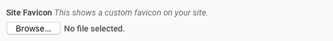
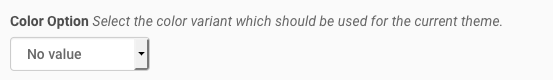
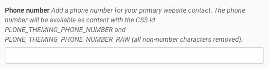
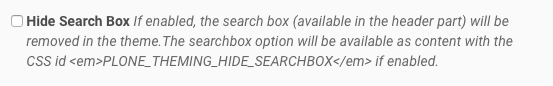
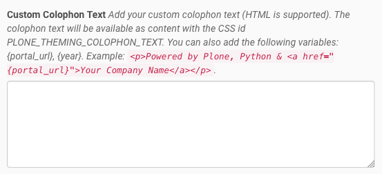

Installation and Configuration
==============================

Install the Add-On
------------------

You can install the Add-On like any other Plone Add-On: click on your username in the *personal tools menu* and select **Site Setup**.
Next, click the **Add-Ons** item in the *Plone Configuration* section.
You should see an item called **spirit.plone.theming**.

.. image:: ../_images/setup_select_add_on.png

Plone Theming Settings
----------------------

Below is a list of currently supported options.
Note that not every theme by default supports all of those options.

Enable Debug Mode
"""""""""""""""""

.. image:: ../_images/settings-debug.png

If enabled, the content of the diazo snippets will be visible to the user.
If disabled, the content is hidden with CSS.
There is also a debug option which will be available as content with the CSS id ``PLONE_THEMING_DEBUG`` if enabled.

Site Favicon
""""""""""""

You can upload a custom favicon for your Plone site.
Any image format can be uploaded, but \*.ico and \*.png files work best.
If no custom icon is set, Plone's default favicon will be used.

Header Option
"""""""""""""

.. image:: ../_images/settings-header_option.png

Select the header variant which should be used for the current theme.

Footer Option
"""""""""""""

.. image:: ../_images/settings-footer_option.png

Select the footer variant which should be used for the current theme.

Color Option
""""""""""""

Select the color variant which should be used for the current theme.

Pattern Option
""""""""""""""

.. image:: ../_images/settings-pattern_option.png

Select the background pattern which should be used for the current theme.

Layout Option
"""""""""""""

.. image:: ../_images/settings-layout_option.png

Select the layout variant which should be used for the current theme.

Slogan
""""""

.. image:: ../_images/settings-slogan.png

Add a slogan for your website (HTML is supported).
The slogan will be available as content with the CSS id ``PLONE_THEMING_SLOGAN``.

Diazo example:

.. code-block:: xml

    <replace css:content="#PLONE_THEMING_SLOGAN" css:theme="#header-headline" />
    <drop css:if-not-content="#PLONE_THEMING_SLOGAN" css:theme="#header-headline" />

Phone number
""""""""""""

Add a phone number for your primary website contact.
The phone number will be available as content with the CSS id ``PLONE_THEMING_PHONE_NUMBER`` and ``PLONE_THEMING_PHONE_NUMBER_RAW`` (all non-number characters removed).

Diazo example:

.. code-block:: xml

    <replace css:content="#PLONE_THEMING_PHONE_NUMBER" css:theme=".site-social-links .phone" />
    <drop css:if-not-content="#PLONE_THEMING_PHONE_NUMBER" css:theme=".site-social-links .phone" />

E-Mail Address
""""""""""""""

Add a valid email address.
The email address will be available as content with the CSS id ``PLONE_THEMING_EMAIL``.

Hide Search Box
"""""""""""""""

If enabled, the search box (available in the header part) will be removed in the theme.
The searchbox option will be available as content with the CSS id ``PLONE_THEMING_HIDE_SEARCHBOX`` if enabled.

Slideshow Fullscreen Mode
"""""""""""""""""""""""""

.. image:: ../_images/settings-slideshow_fullscreen.png

If enabled, a slideshow (if available) will be rendered in fullscreen mode.
Depending on the theme, this might be above the main menu or as header background.
If disabled, the slideshow is visible within the content area.
The slideshow fullscreen mode will be available as content with the CSS id ``PLONE_THEMING_SLIDESHOW_FULLSCREEN`` if enabled.

Custom Footer Text
""""""""""""""""""

.. image:: ../_images/settings-footer_text.png

Add your custom footer text (HTML is supported).
The footer text will be available as content with the CSS id ``PLONE_THEMING_FOOTER_TEXT``.
You can also add the following variables:

- ``{portal_url}``
- ``{year}``

Example:

.. code-block:: html

     
&copy; Copyright 2009-{year} Your Company Name.

Custom Colophon Text
""""""""""""""""""""

Add your custom colophon text (HTML is supported).
The colophon text will be available as content with the CSS id ``PLONE_THEMING_COLOPHON_TEXT``.
You can also add the following variables:

- ``{portal_url}``
- ``{year}``

Example:

.. code-block:: html

     
Powered by Plone, Python &amp; <a href="{portal_url}">Your Company Name</a>

