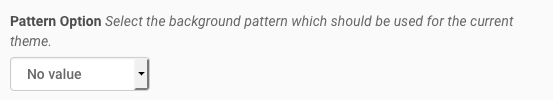

Installation and Configuration
==============================

Install the Add-On
------------------

You can install the Add-On like any other Plone Add-On: click on your username in the *personal tools menu* and select **Site Setup**.
Next, click the **Add-Ons** item in the *Plone Configuration* section.
You should see an item called **spirit.plone.theming**.

.. image:: ../_images/setup_select_add_on.png

Plone Theming Settings
----------------------

Enable Debug Mode
"""""""""""""""""

.. image:: ../_images/settings-debug.png

If enabled, the content of the diazo snippets will be visible to the user.
If disabled, the content is hidden with CSS.
There is also a debug option which will be available as content with the CSS id ``PLONE_THEMING_DEBUG`` if enabled.

Site Favicon
""""""""""""

.. image:: ../_images/settings-site_favicon.png

You can upload a custom favicon for your Plone site.
Any image format can be uploaded, but \*.ico and \*.png files work best.
If no custom icon is set, Plone's default favicon will be used.

Header Option
"""""""""""""

.. image:: ../_images/settings-header_option.png

Select the header variant which should be used for the current theme.

Footer Option
"""""""""""""

.. image:: ../_images/settings-footer_option.png

Select the footer variant which should be used for the current theme.

Color Option
""""""""""""

.. image:: ../_images/settings-color_option.png

Select the color variant which should be used for the current theme.

Pattern Option
""""""""""""""

Select the background pattern which should be used for the current theme.

Layout Option
"""""""""""""

.. image:: ../_images/settings-layout_option.png

Select the layout variant which should be used for the current theme.

Slogan
""""""

Add a slogan for your website (HTML is supported).
The slogan will be available as content with the CSS id ``PLONE_THEMING_SLOGAN``.

Diazo example:

.. code-block:: xml

    <replace css:content="#PLONE_THEMING_SLOGAN" css:theme="#header-headline" />
    <drop css:if-not-content="#PLONE_THEMING_SLOGAN" css:theme="#header-headline" />

Phone number
""""""""""""

.. image:: ../_images/settings-phone_number.png

Add a phone number for your primary website contact.
The phone number will be available as content with the CSS id ``PLONE_THEMING_PHONE_NUMBER`` and ``PLONE_THEMING_PHONE_NUMBER_RAW`` (all non-number characters removed).

Diazo example:

.. code-block:: xml

    <replace css:content="#PLONE_THEMING_PHONE_NUMBER" css:theme=".site-social-links .phone" />
    <drop css:if-not-content="#PLONE_THEMING_PHONE_NUMBER" css:theme=".site-social-links .phone" />
