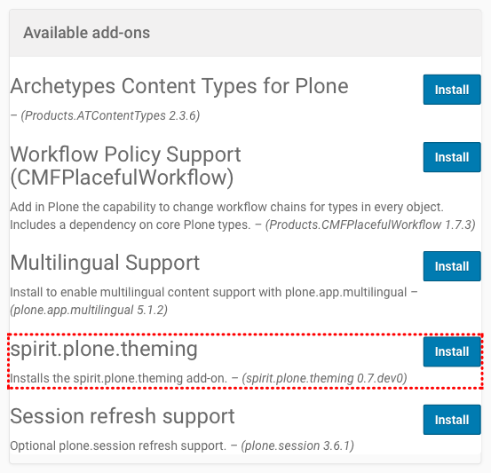
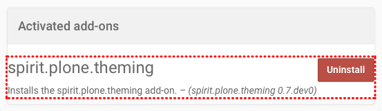
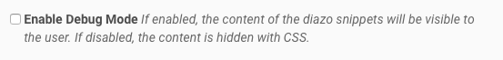
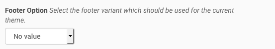
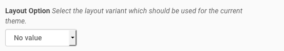
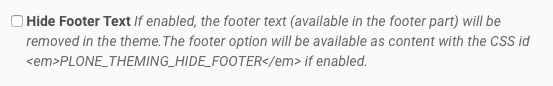
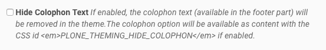

Installation and Configuration
==============================

Install the Add-On
------------------

You can install the Add-On like any other Plone Add-On: click on your username in the *personal tools menu* and select **Site Setup**.
Next, click the **Add-Ons** item in the *Plone Configuration* section.
You should see an item called **spirit.plone.theming**.

You can remove **spirit.plone.theming** again from your Plone site by clicking the uninstall button next to the add-on:

Plone Theming Settings
----------------------

Below is a list of currently supported options.
Note that not every theme by default supports all of those options.

Enable Debug Mode
"""""""""""""""""

If enabled, the content of the diazo snippets will be visible to the user.
If disabled, the content is hidden with CSS.
There is also a debug option which will be available as content with the CSS id ``PLONE_THEMING_DEBUG`` if enabled.

Site Favicon
""""""""""""

.. image:: ../_images/settings-site_favicon.png

You can upload a custom favicon for your Plone site.
Any image format can be uploaded, but \*.ico and \*.png files work best.
If no custom icon is set, Plone's default favicon will be used.
The favicon link HTML markup will be available as content with the CSS id ``PLONE_THEMING_FAVICON``.

Header Option
"""""""""""""

You can select one of the available header options which are provided by the theme, e.g. ``header-v1`` and ``header-v2``.
If no option is selected, the theme might render a default header.
The selected header option will be available as content with the CSS id ``PLONE_THEMING_HEADER_OPTION``.
The theme should set all available header options using the ``spirit.plone.theming.interfaces.IPloneThemingVocabularies.available_header_options`` registry key.

Footer Option
"""""""""""""

You can select one of the available footer options which are provided by the theme, e.g. ``footer-v1`` and ``footer-v2``.
If no option is selected, the theme might render a default footer.
The selected footer option will be available as content with the CSS id ``PLONE_THEMING_FOOTER_OPTION``.
The theme should set all available footer options using the ``spirit.plone.theming.interfaces.IPloneThemingVocabularies.available_footer_options`` registry key.

Color Option
""""""""""""

.. image:: ../_images/settings-color_option.png

You can select one of the available color options which are provided by the theme, e.g. ``blue`` and ``red``.
If no option is selected, the theme might use a default color.
The selected color option will be available as content with the CSS id ``PLONE_THEMING_COLOR_OPTION``.
The theme should set all available color options using the ``spirit.plone.theming.interfaces.IPloneThemingVocabularies.available_color_options`` registry key.

Pattern Option
""""""""""""""

.. image:: ../_images/settings-pattern_option.png

You can select one of the available background pattern options which are provided by the theme, e.g. ``diagonal-noise`` and ``fabric-plaid``.
If no option is selected, the theme might use a default pattern.
The selected pattern option will be available as content with the CSS id ``PLONE_THEMING_PATTERN_OPTION``.
The theme should set all available pattern options using the ``spirit.plone.theming.interfaces.IPloneThemingVocabularies.available_pattern_options`` registry key.

This option could also be used to switch between color modes, e.g. ``light`` and ``dark``, if no patterns are available in the theme.

Layout Option
"""""""""""""

You can select one of the available layout options which are provided by the theme, e.g. ``wide`` and ``boxed``.
If no option is selected, the theme might use a default layout.
The selected layout option will be available as content with the CSS id ``PLONE_THEMING_LAYOUT_OPTION``.
The theme should set all available layout options using the ``spirit.plone.theming.interfaces.IPloneThemingVocabularies.available_layout_options`` registry key.

Slogan
""""""

.. image:: ../_images/settings-slogan.png

Add a slogan for your website (HTML is supported).
The slogan will be available as content with the CSS id ``PLONE_THEMING_SLOGAN``.

Phone number
""""""""""""

.. image:: ../_images/settings-phone_number.png

Add a phone number for your primary website contact.
The phone number will be available as content with the CSS id ``PLONE_THEMING_PHONE_NUMBER`` and ``PLONE_THEMING_PHONE_NUMBER_RAW`` (all non-number characters removed).

E-Mail Address
""""""""""""""

.. image:: ../_images/settings-email.png

Add a valid email address.
The email address will be available as content with the CSS id ``PLONE_THEMING_EMAIL``.

Hide Search Box
"""""""""""""""

.. image:: ../_images/settings-hide_searchbox.png

If enabled, the search box (available in the header part) will be removed in the theme.
The searchbox option will be available as content with the CSS id ``PLONE_THEMING_HIDE_SEARCHBOX`` if enabled.

Slideshow Fullscreen Mode
"""""""""""""""""""""""""

.. image:: ../_images/settings-slideshow_fullscreen.png

If enabled, a slideshow (if available) will be rendered in fullscreen mode.
Depending on the theme, this might be above the main menu or as header background.
If disabled, the slideshow is visible within the content area.
The slideshow fullscreen mode will be available as content with the CSS id ``PLONE_THEMING_SLIDESHOW_FULLSCREEN`` if enabled.

Custom Footer Text
""""""""""""""""""

.. image:: ../_images/settings-footer_text.png

Add your custom footer text (HTML is supported).
The footer text will be available as content with the CSS id ``PLONE_THEMING_FOOTER_TEXT``.
You can also add the following variables:

- ``{portal_url}``
- ``{year}``

Example:

.. code-block:: html

     
&copy; Copyright 2009-{year} Your Company Name.

Hide Footer Text
""""""""""""""""

If enabled, the footer text (available in the footer part) will be removed in the theme.
The footer option will be available as content with the CSS id ``PLONE_THEMING_HIDE_FOOTER`` if enabled.

Custom Colophon Text
""""""""""""""""""""

.. image:: ../_images/settings-colophon_text.png

Add your custom colophon text (HTML is supported).
The colophon text will be available as content with the CSS id ``PLONE_THEMING_COLOPHON_TEXT``.
You can also add the following variables:

- ``{portal_url}``
- ``{year}``

Example:

.. code-block:: html

     
Powered by Plone, Python &amp; <a href="{portal_url}">Your Company Name</a>

Hide Colophon Text
""""""""""""""""""

If enabled, the colophon text (available in the footer part) will be removed in the theme.
The colophon option will be available as content with the CSS id ``PLONE_THEMING_HIDE_COLOPHON`` if enabled.
